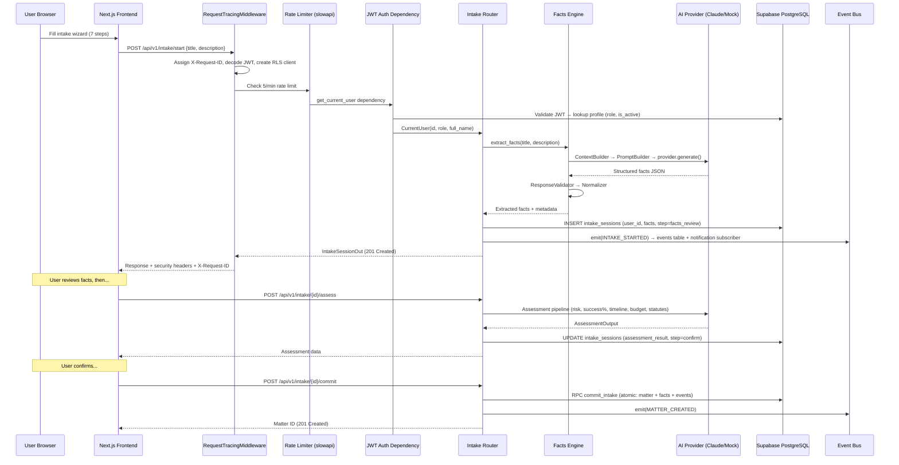

# LeAd Platform — Onboarding Deep-Dive

## Overview

LeAd is an AI-powered legal workflow platform for India. It takes plain-language citizen complaints and transforms them into structured legal cases through a multi-step intake pipeline: natural language → AI-extracted facts → legal assessment (risk, timeline, statutes) → committed matter. The platform then supports the full case lifecycle: lawyer matching, document drafting (legal notices, vakalatnamas), consultation booking, milestone billing, court hearing scheduling, and an interactive courtroom practice simulator for legal training.

**Target users:** Indian citizens needing legal help (petitioners/users), practicing lawyers, and platform administrators.

---

## Tech Stack

| Layer | Technology | Version |
|-------|-----------|---------|
| Frontend | Next.js (App Router, Turbopack) | 15.1+ |
| UI/Styling | Tailwind CSS v4, Lucide icons | v4 |
| Frontend State | TanStack React Query v5, React Hook Form, Zod | 5.62+ |
| Language (FE) | TypeScript | 5.x |
| Backend | Python, FastAPI, Pydantic v2 | 3.12+, 0.115+ |
| Auth | Supabase Auth (JWT, SSR cookies) | — |
| Database | Supabase PostgreSQL + Row Level Security | — |
| AI Providers | Claude (Anthropic SDK), Gemini, OpenAI-compatible, Mock | anthropic 0.40, google-generativeai 0.8 |
| Notifications | Resend (email), Twilio (SMS), SSE (real-time), In-app | — |
| Rate Limiting | slowapi (Redis or memory backend) | — |
| Deployment | Render.com (via deploy hook), Docker | — |
| CI/CD | GitHub Actions (3-job pipeline) | — |
| Package Manager | npm (frontend), pip (backend) | — |

---

## Architecture

### Request Lifecycle (Intake → Matter Creation)



### System Architecture Overview

```
┌─────────────────────────────────────────────────────────────────┐
│                     Next.js 15 Frontend                          │
│  ┌──────┐  ┌─────────┐  ┌──────────┐  ┌────────┐  ┌────────┐ │
│  │Landing│  │IntakeWiz│  │MatterDet│  │Practice│  │LegalTool│ │
│  └───┬───┘  └────┬────┘  └─────┬────┘  └───┬────┘  └────┬───┘ │
│      └──────┬────┴──────────────┴───────────┴──────────┬─┘     │
│        TanStack Query + apiClient (fetch wrapper)       │       │
│             │ Supabase Auth (JWT in Authorization)      │       │
└─────────────┼──────────────────────────────────────────┼───────┘
              │ REST API                                  │ Supabase Direct
              ▼                                          ▼
┌─────────────────────────────────────────────┐  ┌──────────────┐
│           FastAPI Backend                     │  │ Supabase Auth│
│  ┌─────────────────────────────────────────┐│  │   (signup,   │
│  │ RequestTracingMiddleware                 ││  │    login)    │
│  │ (request ID, JWT decode, RLS client)     ││  └──────────────┘
│  └─────────────────────────────────────────┘│
│  ┌─────────────────────────────────────────┐│
│  │ Domains:                                 ││
│  │ identity │ intake │ matters │ assessment ││
│  │ matching │ admin │ legal_tools │ notifs  ││
│  │ consultations │ practice │ system        ││
│  └─────────────────────────────────────────┘│
│  ┌─────────────────────────────────────────┐│
│  │ Shared: AI Pipeline │ Events │ JWT │ DB  ││
│  └─────────────────────────────────────────┘│
└───────────────────────┬─────────────────────┘
                        │ Service-role client (bypasses RLS)
                        ▼
┌─────────────────────────────────────────────────────────────────┐
│            Supabase PostgreSQL                                    │
│  profiles │ matters │ facts │ events │ intake_sessions           │
│  consultations │ hearings │ milestones │ meetings │ payments     │
│  notifications │ lawyer_profiles │ practice_* │ audit_logs       │
│  ─────────────────────────────────────────────────────────────── │
│  Row Level Security (auth.uid() scoped) + service_role bypass    │
│  DB RPCs: commit_intake, assign_free_lawyer, transition_status   │
└─────────────────────────────────────────────────────────────────┘
```

---

## Backend Map

### Entry Point

`apps/api/app/main.py` — Creates the FastAPI app with:
1. Settings loaded via pydantic-settings from `.env`
2. Supabase connection verification on startup
3. `RequestTracingMiddleware` (request IDs, JWT decode, RLS client, security headers)
4. CORS middleware
5. 11 domain routers registered under `/api/v1`
6. Lifespan context initializing notification subscriber, AI provider validation, practice scenario loading
7. Global unhandled exception handler (500 with request_id)
8. Rate limiter (slowapi) attached to app state

### Key Modules

| Domain | Prefix | Key Responsibility |
|--------|--------|-------------------|
| **Identity** | `/identity` | Profile registration (forces role=user), self-read, self-update |
| **Intake** | `/intake` | 4-step workflow: describe → extract facts → assess → commit. The core value proposition. |
| **Assessment** | `/assessment` | Provider-agnostic AI assessment orchestration with fallback chain |
| **Matters** | `/matters` | Full case lifecycle (CRUD, facts, hearings, milestones, meetings, payments, timeline) |
| **Matching** | `/matching` | Lawyer discovery, contact requests, accept/decline with optimistic locking |
| **Admin** | `/admin` | Platform stats, lawyer verification/suspension, user/matter management |
| **Legal Tools** | `/legal-tools` | Deterministic legal calculators (NI Act S.138, RERA, CPC O.37), document drafting |
| **Notifications** | `/notifications` | Multi-channel (email/SMS/in-app/SSE) event-driven notifications |
| **Consultations** | `/consultations` | Booking system with packages (free/starter/full), auto-assignment |
| **Practice** | `/practice` | Interactive branching-scenario courtroom simulator |
| **System** | `/system` | Cron endpoints (session cleanup) |

### Shared Infrastructure

| Module | Purpose |
|--------|---------|
| `shared/database.py` | Singleton service-role Supabase client + ContextVar request-scoped RLS client |
| `shared/dependencies.py` | Auth type aliases: `Auth`, `AdminAuth`, `LawyerVerifiedAuth`, `LawyerOrAdmin`, `PetitionerAuth` |
| `shared/jwt.py` | Dual-algorithm JWT decoder (HS256 symmetric + ES256/JWKS) |
| `shared/events.py` | Event bus: `emit()` writes to events table + dispatches to async subscribers |
| `shared/exceptions.py` | `NotFound`, `Forbidden`, `Conflict`, `BadRequest` (all extend HTTPException) |
| `shared/middleware.py` | Request tracing, JWT decode, RLS client creation, security headers, timing |
| `shared/ai/registry.py` | Provider resolution with health-check fallback chain |
| `shared/ai/base.py` | Abstract `BaseAiProvider` interface |
| `shared/ai/claude.py` | Anthropic SDK provider (claude-sonnet-4, 30s timeout) |
| `shared/ai/mock.py` | Deterministic mock for dev/test (covers cheque_bounce, consumer, rera) |
| `shared/court_calendar.py` | `next_working_day()` for legal deadline calculations |
| `shared/limiter.py` | slowapi rate limiter (100/min global, 5/min on AI endpoints) |

### Data Model (Core Relationships)

```
profiles (1:1 auth.users)
    ├── lawyer_profiles (1:1, extends profile for lawyers)
    ├── intake_sessions (1:N, user's intake workflows)
    │       └── matters (1:1, committed intake becomes matter)
    ├── matters (1:N as user, 1:N as lawyer)
    │       ├── facts (1:N, structured key-value facts)
    │       ├── events (1:N, immutable audit log — ON DELETE RESTRICT)
    │       ├── matter_updates (1:N, timeline entries)
    │       ├── documents (1:N, uploaded files)
    │       ├── hearings (1:N, court dates)
    │       ├── matter_milestones (1:N, progress tracking + billing)
    │       ├── meetings (1:N, scheduled meetings)
    │       ├── consultations (1:1, lawyer-client booking)
    │       └── lawyer_requests (1:N, contact requests)
    ├── notifications (1:N, user inbox)
    ├── practice_sessions (1:N, training sessions)
    └── practice_profiles (1:N, skill tracking per issue_tag)
```

### Auth Strategy

- **JWT-based** via Supabase Auth
- Middleware decodes JWT on every request → creates request-scoped Supabase client with user's JWT (enforces RLS)
- `get_current_user` dependency: extracts Bearer token → decodes (HS256 or ES256/JWKS) → validates aud/iss/exp → looks up profile in DB → checks is_active
- Role guards via `require_roles()` factory: Admin, LawyerVerified, LawyerOrAdmin, Petitioner
- Registration always forces `role=user` (prevents self-elevation)
- SSE uses short-lived tickets (30s) instead of Bearer tokens

### AI Integration

Provider registry with health-check fallback chain:
1. Explicitly configured `AI_PROVIDER_TYPE`, else:
2. `ANTHROPIC_API_KEY` → Claude (claude-sonnet-4)
3. `GEMINI_API_KEY` → Gemini 2.0 Flash
4. `AI_API_BASE_URL` → OpenAI-compatible (Ollama/local)
5. Default → Mock (deterministic, free)

Pipeline: `ContextBuilder → PromptBuilder (versioned) → provider.generate() → ResponseValidator → Normalizer`

---

## Frontend Map

### Routing Structure (Next.js 15 App Router)

```
app/
├── page.tsx                          # Marketing landing page
├── (auth)/
│   ├── layout.tsx                    # Centered card layout
│   ├── login/page.tsx                # Email/password login
│   └── register/page.tsx             # Role selector + registration
└── (dashboard)/
    ├── layout.tsx                    # Sidebar + main (checks auth)
    ├── user/                         # Petitioner role
    │   ├── layout.tsx                # Role guard (role=user)
    │   ├── dashboard/page.tsx        # Action cards, recent cases
    │   ├── matters/page.tsx          # Case list + IntakeWizard modal
    │   ├── matters/[id]/page.tsx     # Full case detail
    │   ├── lawyers/page.tsx          # Find & contact lawyers
    │   ├── legal-tools/page.tsx      # Calculators
    │   ├── legal-notice/page.tsx     # Notice wizard
    │   ├── practice/page.tsx         # Practice hub
    │   ├── practice/[sessionId]      # Active session
    │   ├── practice/profile          # Skill dashboard
    │   └── notifications/page.tsx    # Notification inbox
    ├── lawyer/                       # Lawyer role
    │   ├── layout.tsx                # Role guard + is_verified check
    │   ├── dashboard/page.tsx        # Assigned matters
    │   ├── matters/page.tsx          # Matter management
    │   ├── clients/page.tsx          # Incoming requests
    │   ├── legal-notice/page.tsx     # Notice drafting
    │   ├── legal-tools/page.tsx      # Calculators
    │   └── practice/...              # Practice (same as user)
    └── admin/                        # Admin role
        ├── layout.tsx                # Role guard (role=admin)
        ├── dashboard/page.tsx        # Platform stats
        ├── lawyers/page.tsx          # Verification queue
        ├── users/page.tsx            # User management
        └── matters/page.tsx          # All matters
```

### State Management

- **TanStack React Query v5** — Primary server-state cache (60s staleTime, retry=1)
- **React Hook Form + Zod** — Form state and validation (login, register, intake, legal notice)
- **sessionStorage** — IntakeWizard draft persistence (survives refresh within tab)
- **No Redux/Zustand** — All state is query-cache or component-local
- Feature flags fetched once via `useFeatures()` (staleTime: Infinity)

### API Client (`shared/lib/api/client.ts`)

Thin fetch wrapper that:
1. Prepends `NEXT_PUBLIC_API_URL + /api/v1`
2. Auto-attaches Supabase access_token as Bearer header
3. Proactive token refresh (if expiring within 10s)
4. Auto-retry: 2x for 5xx with exponential backoff (300ms, 600ms)
5. 15-second AbortController timeout
6. On 401: attempts token refresh + retry; if still 401, signs out → `/login?notice=session-expired`
7. Parses FastAPI validation error arrays into readable strings

### Key Components

| Component | Location | Description |
|-----------|----------|-------------|
| `IntakeWizard` | `features/intake/components/` | 7-step modal: domain → subtype → core facts → category facts → describe → assessment → confirm |
| `PracticeHub` | `features/practice/components/` | Scenario browser with domain/difficulty filters |
| `SessionView` | `features/practice/components/` | Branching-narrative courtroom simulator |
| `CalculatorsView` | `features/legal-tools/components/` | Three Indian legal calculators |
| `LegalNoticeWizard` | `features/legal-notice/components/` | Client-side notice template generator |
| `DocumentVault` | `features/matters/components/` | File upload/download for case documents |
| `FactsPanel` | `features/matters/components/` | Case facts display and editing |
| `Sidebar` | `shared/components/layout/` | Role-aware navigation with feature-flag filtering |
| `NotificationBell` | `shared/components/layout/` | Polling notification indicator |
| UI Primitives | `shared/components/ui/` | Button, Badge, Card, Input, Spinner, EmptyState, etc. |

---

## Walked User Flows

### Flow 1: New Case Intake (Core Happy Path)

**What it does:** User describes a legal problem → AI extracts facts → AI assesses case → Matter created.

| Step | User Action | What Happens | Backend Endpoint | Frontend Component |
|------|------------|--------------|-----------------|-------------------|
| 1 | Visits `/user/matters` | Case list loads | `GET /matters` | `UserCasesPage` |
| 2 | Clicks "New Case" button | IntakeWizard modal opens (step 1: DomainStep) | — | `IntakeWizard` |
| 3 | Selects legal domain (e.g. "Cheque Bounce") | Advances to SubtypeStep | — | `DomainStep` |
| 4 | Selects subtype (e.g. "Notice not sent on time") | Advances to CoreFactsStep | — | `SubtypeStep` |
| 5 | Fills universal facts (date, location, opponent, urgency) | Validated via Zod schema | — | `CoreFactsStep` |
| 6 | Fills category-specific facts | Dynamic fields from `SUBTYPE_FIELDS` | — | `CategoryFactsStep` |
| 7 | Optionally adds title + description | Free text | — | `DescribeStep` |
| 8 | Clicks "Analyze My Case" | Three API calls fire sequentially | `POST /intake/start` → `PATCH /intake/{id}/facts` → `POST /intake/{id}/assess` | `useIntake` |
| 9 | Assessment displays | Risk level, success %, timeline, statutes, next actions | — | `AssessmentStep` |
| 10 | Clicks "Create Case" | Atomically creates matter | `POST /intake/{id}/commit` | `ConfirmationStep` |
| 11 | Success state with link | Navigate to matter detail | — | Done state |

**Draft persistence:** Every step change saves to `sessionStorage`. Refreshing mid-wizard restores state.

### Flow 2: Lawyer Matching

| Step | Action | Endpoint | Component |
|------|--------|----------|-----------|
| 1 | Navigate to `/user/lawyers` | `GET /matching/lawyers` | `LawyersPage` |
| 2 | Filter by city/specialization | Query params | Filter UI |
| 3 | Click "Contact" on a lawyer | `POST /matching/lawyers/{id}/contact` | Contact button |
| 4 | Lawyer sees incoming request | `GET /matching/requests/incoming` | `LawyerClientsPage` |
| 5 | Lawyer accepts | `PATCH /matching/requests/{id}` | Accept button |
| 6 | Matter transitions to active | Optimistic lock: only if `lawyer_id IS NULL` | — |

### Flow 3: Practice Simulator

| Step | Action | Endpoint | Component |
|------|--------|----------|-----------|
| 1 | Navigate to `/user/practice` | `GET /practice/scenarios` | `PracticeHub` |
| 2 | Select scenario (e.g. "Late Notice Trap") | — | `ScenarioCard` |
| 3 | Click "Start" | `POST /practice/sessions` | `PracticeHub` |
| 4 | Read narrative, choose decision | `POST /practice/sessions/{id}/decide` | `SessionView` + `ChoiceCard` |
| 5 | See feedback + citation | Response includes `is_correct`, `score_awarded`, `feedback` | `DecisionFeedback` |
| 6 | Repeat until session complete | Query invalidation → next node | `SessionView` |
| 7 | View debrief analysis | `GET /practice/sessions/{id}/debrief` | `DebriefPanel` |
| 8 | Check skill profile | `GET /practice/profile` | `ProfileDashboard` |

### Flow 4: Legal Tools (No Auth Required for Calculation)

| Step | Action | Endpoint | Component |
|------|--------|----------|-----------|
| 1 | Navigate to `/user/legal-tools` | — | `CalculatorsView` |
| 2 | Select calculator (e.g. Cheque Bounce) | — | Tab selection |
| 3 | Enter dates (cheque, dishonour, etc.) | — | Form fields |
| 4 | Click "Calculate" | `POST /legal-tools/calculators/cheque-bounce` | API call |
| 5 | See timeline validation result | Traffic-light status (safe/action_required/expired) | Result display |

---

## Phase 0 Outcome (Getting the App Running)

### What worked:
- ✅ Python dependencies installed (Python 3.14)
- ✅ Node dependencies installed (Node 22)
- ✅ Backend config loads successfully in `mock` AI mode
- ✅ **Frontend starts and serves landing page on http://localhost:3000** (HTTP 200)

### What didn't work:
- ❌ **Backend won't start** — `main.py:63` explicitly rejects placeholder Supabase values. The app requires a real Supabase instance (URL that isn't `http://placeholder.supabase.co` and a JWT secret without "placeholder" in it).
- ❌ **No Docker** available in this environment
- ❌ **No Supabase CLI** available (required for `supabase start` local instance)

### What's needed to get full stack running:
1. Install Docker + Supabase CLI, then `supabase start` for a local Supabase instance
2. Or: Use a real Supabase project URL/keys (even a free-tier project)
3. Apply migrations: `supabase db reset` (local) or `supabase db push` (remote)
4. No seed data scripts exist — first user creates account via `/register`

### Auth note:
- No seeded/demo accounts in the codebase
- Signup flow uses Supabase Auth (email + password) — email confirmation may be required depending on Supabase project config
- Role elevation (user → lawyer, user → admin) must be done via direct DB update or admin panel

---

## Risks / Rough Edges

### Backend Fragility

| # | Issue | Impact | Location |
|---|-------|--------|----------|
| 1 | **Event bus has no durability** — subscriber tasks are in-process asyncio only. Server restart = lost notifications. | Data loss on restart/deploy | `shared/events.py` (H5 warning) |
| 2 | **JWT decoded twice per request** — once in middleware (silently swallows errors), again in auth dependency. Invalid token still creates an unauthenticated DB client. | Subtle auth bypass edge case | `shared/middleware.py` |
| 3 | **Supabase client created per-request** — no connection pooling. Expensive at scale. | Performance degradation | `shared/middleware.py` |
| 4 | **SSE tickets stored in-process memory** — multi-instance deployment breaks ticket redemption. | Broken real-time notifications in scaled deployment | `notifications/channels/sse_broadcaster.py` |
| 5 | **Rate limiting is per-process** — without Redis, limits don't aggregate across workers. | Rate limits ineffective in production | `shared/limiter.py` |
| 6 | **No rate limits on legal tools, consultations, document drafting** — only 4 routes throttled. | Abuse potential | Various routers |
| 7 | **Mock provider silently replaces real AI on failure in non-prod** — no visible indicator to user. | False confidence in dev/staging results | `shared/ai/registry.py` |
| 8 | **`safe_eval` in practice rules engine** — AST-based sandbox may have edge cases. | Potential DoS via crafted expressions | `practice/rules_engine.py` |

### Database Risks

| # | Issue | Impact | Location |
|---|-------|--------|----------|
| 1 | **Migrations 019/023 not wrapped in transactions** — partial application on failure. | Broken DB state on failed migration | `supabase/migrations/` |
| 2 | **`events.event_type` is free text** — no enum constraint on event types. | Silent data quality drift | Schema |
| 3 | **`commit_intake` redefined 3 times** — DROP FUNCTION creates brief unavailability window. | Potential 500s during migration | Migrations 004, 025, 029 |
| 4 | **Practice `submit_practice_decision` RPC accepts `p_user_id` without verifying against `auth.uid()`** — user can submit decisions for others. | Security: impersonation | Migration 031 |
| 5 | **Soft-delete trigger intercepts DELETE** — ON DELETE CASCADE on children never fires. | Potential orphaned records | Migration 005 |
| 6 | **No automated migration in CI/CD** — manual application required. | Production drift risk | `.github/workflows/ci.yml` |

### Frontend Rough Edges

| # | Issue | Impact | Location |
|---|-------|--------|----------|
| 1 | **API client does NOT implement response envelope** described in CLAUDE.md. Returns raw JSON. | Contract mismatch risk | `shared/lib/api/client.ts` |
| 2 | **Lawyer registration redirects to `/user/dashboard`** — confusing UX for new lawyers. | User confusion | `(auth)/register/page.tsx:69` |
| 3 | **LegalNoticeWizard is purely client-side** with AI-suggesting UI (sparkles icon) — misleading. | Trust/legal liability risk | `legal-notice/components/` |
| 4 | **IntakeWizard stores sensitive case data in sessionStorage** as plain JSON. | XSS → data exposure | `features/intake/` |
| 5 | **Admin dashboard fetches auth client-side** (useEffect) while others use server-side — flash of unauthenticated content. | Inconsistency, brief auth flash | `admin/dashboard/page.tsx` |
| 6 | **CSP nonce extracted but never used** — incomplete Content Security Policy. | Security headers not functional | `app/layout.tsx` |
| 7 | **Role-based route protection duplicated across every layout** — 2+ auth round-trips per page. | Performance cost | All layout.tsx files |
| 8 | **No error boundary on landing page** — a crash in any landing section takes down the entire page. | Full-page crash on marketing page | `app/page.tsx` |
| 9 | **Hardcoded SBI MCLR rate (8.5%)** with last-updated date of 2025-06-01 — now 13+ months stale. | Incorrect legal calculations | `legal_tools/services/interest.py` |
| 10 | **Toast errors in useEffect watching query.error** — anti-pattern causing duplicate toasts in StrictMode. | UX annoyance | `useLawyers.ts` |

### Cross-Cutting Risks

| # | Issue | Impact |
|---|-------|--------|
| 1 | No external error monitoring (Sentry, etc.) — TODO comment only | Silent production failures |
| 2 | No unit tests for event bus or notification channels | Regression risk in critical paths |
| 3 | No E2E tests beyond a single intake flow spec | Major flows untested end-to-end |
| 4 | X-Forwarded-For trusted for rate limiting without spoofing protection | Rate limit bypass possible |
| 5 | SSE broadcaster has no queue size limit or TTL | Memory leak on dropped connections |
| 6 | No middleware.ts visible despite x-pathname header usage in layouts | Possible broken header injection |

---

## Open Questions

1. **Supabase project**: Is there a shared development Supabase project, or does each developer need their own? No onboarding docs beyond "fill in keys."

2. **Email confirmation**: Is Supabase email confirmation enabled in the shared project? This affects whether new signups can immediately use the platform.

3. **Production deployment**: The README mentions Render.com, but is the frontend on Render too, or Vercel? The CI deploys via a single Render hook — unclear if that covers both services.

4. **Admin bootstrapping**: How is the first admin user created? No seed script exists, and registration forces `role=user`. Presumably a direct DB update, but this isn't documented.

5. **MCLR rate update process**: The hardcoded SBI MCLR rate is 13 months stale. Is there a process for updating this, or is it expected to be a manual code change?

6. **Feature flag source of truth**: Feature flags come from both backend Settings (env vars) and a `GET /system/features` endpoint. Which is authoritative? The frontend also checks them — is there a single definition?

7. **Payment integration status**: Razorpay webhook code exists but `FEATURE_BILLING=false` by default. Is this in active development or deferred?

8. **Practice scenario authoring**: Who creates YAML scenarios? Are there plans for a self-serve editor, or will they always be code-committed?

9. **Multi-instance deployment**: Given SSE tickets and event bus are in-process memory, is the production deployment single-instance only? If multiple instances are planned, these need Redis/external backing.

10. **The old CLAUDE.md in the project root**: The root `CLAUDE.md` describes patterns (`@api_handler`, `ApiError`, `ApiResponse`) that **do not exist** in the actual codebase — the real code uses FastAPI's native patterns (`HTTPException` subclasses, direct response returns). Is this an aspirational document from a different project (the "SDLC Studio" mentioned in its header), or should the real code be refactored to match it?
